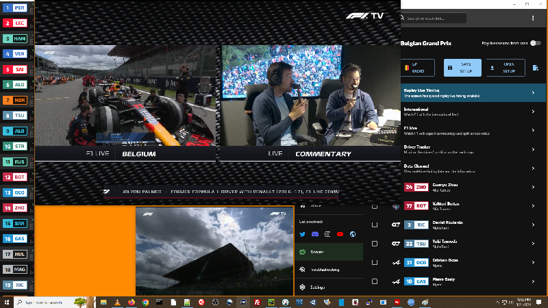

My scripts rely on win32gui. It can tell what (and where and size) windows are open on the desktop and can move them around. It can't open a new driver window or change the stream.

# Main Screen Turn On

Here are the 3 settings for my main screen, it's 1920x1080. It puts the Timing window on the left like a pole. It arranges the F1 feed and Int feed (or the Pit Lane feed on the older races). And it puts the MV menu on the right. 



```
py {path}\main_screen_turn_on.py big
```
```
py {path}\main_screen_turn_on.py small
```
```
py {path}\main_screen_turn_on.py pycharm
```
